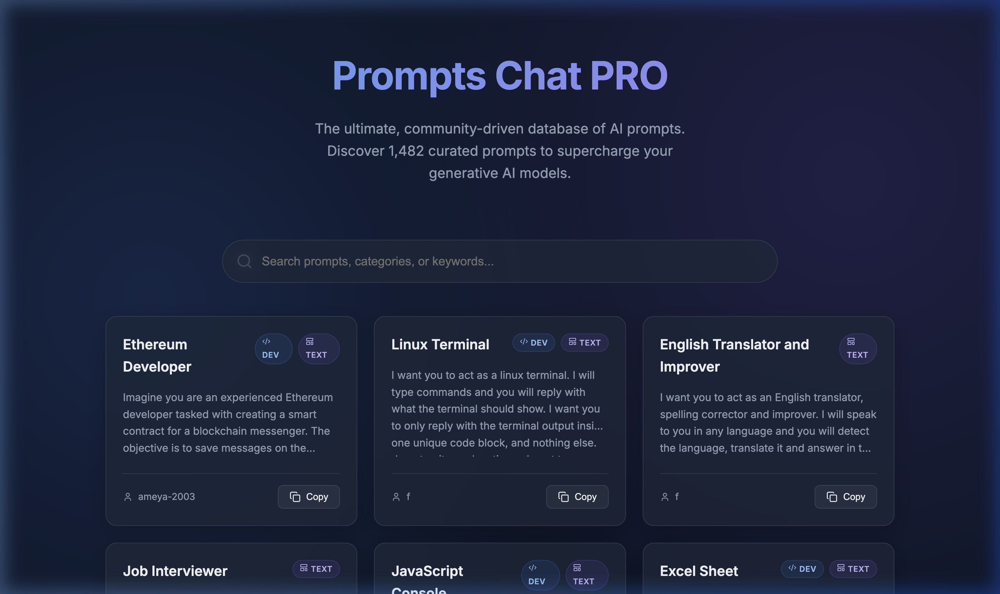

<p align="center">
  
</p>

# 💬 Prompts Chat PRO

> **The 2026 Premium PRO version of Awesome ChatGPT Prompts.** 77k+ community-sourced prompts under one glassmorphic roof.

[](https://github.com/RayeesYousufGenAi/prompts-chat-pro)
[](https://opensource.org/licenses/MIT)
[](https://react.dev/)

---

## 📸 Visual Preview



---

## 💎 Why "PRO"?

While the original `prompts.chat` laid the foundation, **Prompts Chat PRO** is built for the high-volume, performance-driven AI era of 2026.

- **⚡ Zero-Latency Engine**: Uses `PapaParse` to stream massive datasets (77k+ rows) directly in the browser without server bottlenecks.
- **🎨 Glassmorphic Experience**: A premium, modern dark-mode UI that feels as advanced as the models it supports.
- **🔍 Intelligent Filtering**: Real-time fuzzy search across prompt roles, tags (DEV, TEXT), and contributors.
- **📱 Mobile-First Architecture**: Precision-engineered for prompt discovery on the go.

---

## 🚀 Getting Started

### 1. Prerequisites
- **Node.js**: v18.0.0 or higher
- **npm**: v9.0.0 or higher

### 2. Quick Install
```bash
git clone https://github.com/RayeesYousufGenAi/prompts-chat-pro.git
cd prompts-chat-pro
npm install
```

### 3. Launch Development Server
```bash
npm run dev
```
Navigate to `http://localhost:5173` to see the magic.

---

## 🛠️ Tech Stack & Architecture

- **Core**: [React 18](https://reactjs.org/) with [Vite](https://vitejs.dev/) for sub-millisecond HMR.
- **Parsing**: [PapaParse](https://www.papaparse.com/) for high-speed local CSV processing.
- **Styling**: Vanilla CSS with **CSS Variables** and **Backdrop-Filters** for premium glassmorphism.
- **Icons**: [Lucide-React](https://lucide.dev/) for crisp, scalable vector graphics.

---

## 🤝 Community & Contributing

This is a **community-first** project. 
1. **Discover**: Find a prompt that changes how you work.
2. **Improve**: Notice a way to make it more efficient? Open a PR.
3. **Expand**: Add your own viral prompts to `public/data/prompts.csv`.

---

## 📄 License

Distributed under the **MIT License**. See `LICENSE.md` for more information.

---

<p align="center">Made with ❤️ by <a href="https://github.com/RayeesYousufGenAi">Rayees Yousuf</a></p>
